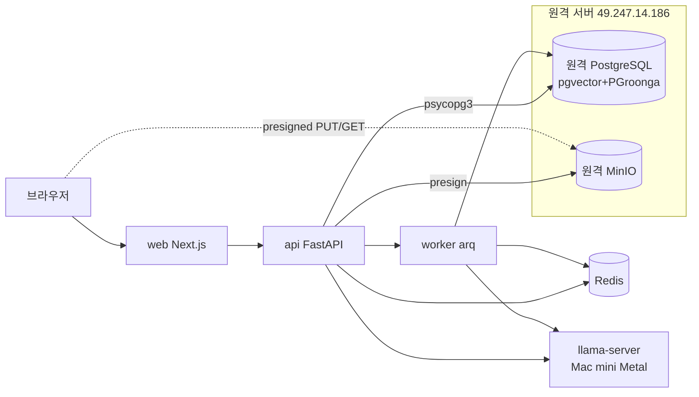

# 01. 시스템 개요 아키텍처

## 1. 개요 / 범위
문서를 업로드하면 AI가 읽고 이해해 **검색·질문(RAG)·요약/초안/보고서**를 제공하는 한국어 문서 아카이브.

- **범위(MVP):** 폴더/문서 CRUD, 업로드, 텍스트 추출·OCR, 메타데이터·임베딩, 하이브리드 검색, RAG 답변, AI 산출물(요약/초안/보고서)+계보.
- **비범위:** 멀티테넌시/권한 세분화, AWS Bedrock 실구현(인터페이스만), 실시간 협업.

## 2. 요구사항 매핑
| 기능 | 문서 |
|---|---|
| 폴더 트리 CRUD | [05](./05-folder-management.md) |
| 문서 업/다운로드 | [06](./06-document-storage.md) |
| 추출·OCR·메타·임베딩 | [07](./07-document-processing-pipeline.md) |
| 키워드/의미/RAG 검색 | [08](./08-search-and-rag.md) |
| 요약/초안/보고서·계보 | [09](./09-ai-outputs-and-lineage.md) |
| 3-Panel UI | [10](./10-frontend-drive-ui.md) |
| 데이터 모델·인프라·백엔드 | [02](./02-infrastructure-and-environment.md)·[03](./03-data-model-and-migrations.md)·[04](./04-backend-application.md) |

## 3. 설계 결정
| 항목 | 결정 | 근거(research) |
|---|---|---|
| 생성 LLM | A.X 4.0 Light 7B (Apache 2.0) | 00 §1.1 |
| 임베딩 | KURE-v1 1024d | 00 §1.2 |
| OCR | PaddleOCR+Tesseract+(선택)Qwen2.5-VL | 00 §1.3 |
| 검색 | PGroonga + pgvector, RRF | 02 |
| 계보 | `generations` 헤드+하위 | 03 §4 |
| Provider | 로컬 llama.cpp(추후 Bedrock 교체) | 04 §0 |
| **인프라 보정** | **PG·MinIO 원격 고정**(로컬 중복 금지) | 본 프로젝트 제약 |

**Qwen2.5-VL**: 표·복잡 레이아웃 등 전통 OCR이 약한 "어려운 페이지"의 VLM OCR 폴백(상시 X, 온디맨드).

## 4. 컴포넌트
| 컴포넌트 | 책임 | 위치 |
|---|---|---|
| web (Next.js) | 3-Panel UI, presigned 직접 업/다운로드 | 로컬/서버 |
| api (FastAPI) | REST, 비즈니스 로직, presign 발급 | 로컬/서버 |
| worker (arq) | 인제스트·AI 생성 비동기 처리 | 로컬/서버 |
| Redis | arq 큐 백엔드 | 별도 provisioning |
| llama-server | 생성(8080)·임베딩(8081) | **개발자 Mac mini(네이티브 Metal)** |
| PostgreSQL+pgvector+PGroonga | 메타·청크·벡터·계보·검색 | **원격(49.247.14.186:5432)** |
| MinIO | 원본 파일 | **원격(49.247.14.186:9000)** |

## 5. 기술 스택
Next.js 16/React 19/TS/Tailwind 4/shadcn · FastAPI/Pydantic v2/SQLAlchemy 2/Alembic · PostgreSQL+pgvector+PGroonga · MinIO · llama.cpp · arq/Redis.

## 6. 핵심 데이터 흐름
- **인제스트:** 업로드(presigned) → 추출 → 메타 → 청킹 → 임베딩 → PG 저장.
- **질의(RAG):** 질문 → (라우팅) → 하이브리드 검색 → 컨텍스트 조립 → 인용 강제 생성 → 답변+출처.
- **AI 산출물:** 선택 문서 → 요약/초안/보고서 생성 → 계보 기록.

## 7. 횡단 관심사
비동기·멱등성(arq), 계보·감사(generations), Provider 추상화(로컬↔Bedrock), 한국어 처리(UTF-8·PGroonga), 소유자 스코프(`owner_id` 강제).

## 8. 배포 토폴로지

원격 경계: PG·MinIO만 원격. 나머지(api·worker·web·redis·llama-server)는 로컬/개발 환경.

## 9. TL;DR 결정표
research [README](../research/README.md) TL;DR을 따르되 **인프라는 PG·MinIO 원격 고정**, **llama-server는 개발자 Mac mini 네이티브 실행**으로 확정.

## 참고
`research/00`, `research/04`, `research/06-glossary.md`.
