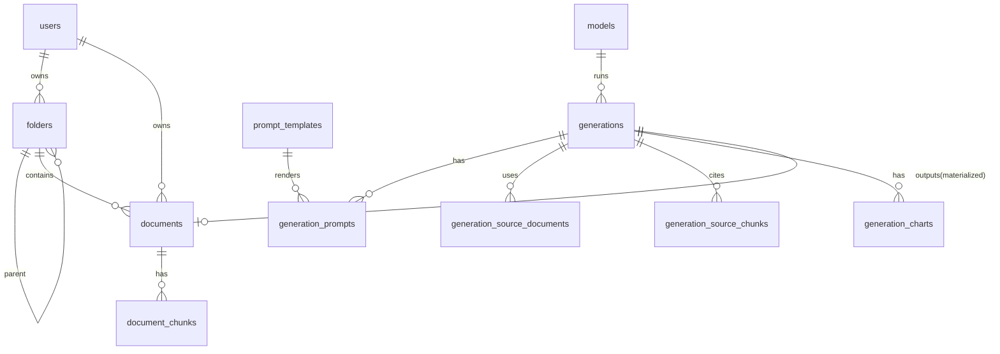
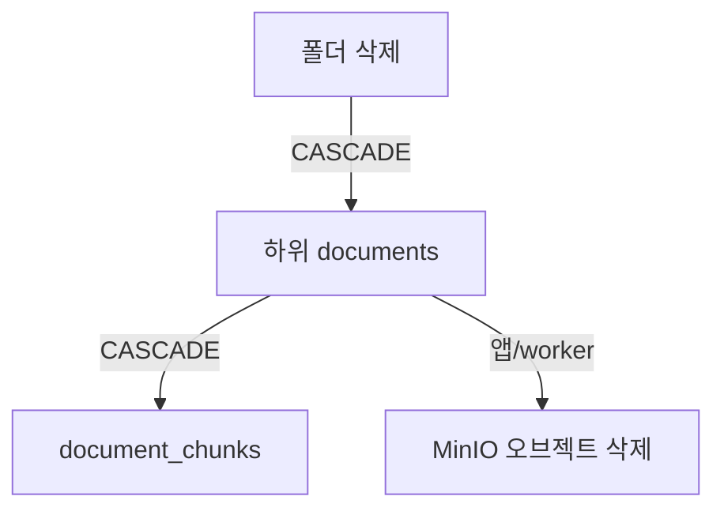

# 03. 데이터 모델 & 마이그레이션 아키텍처

## 1. 개요 / 범위
폴더·문서·청크·계보 전체 스키마와 Alembic 전략. 모든 테이블은 전용 스키마 `archive`에 둔다(02 §7).

## 2. 요구사항 매핑
데이터 모델 전체 + 마이그레이션(원격 공유 DB 대상).

## 3. 설계 결정
- 임베딩 차원 **1024** 전 시스템 통일, HNSW cosine.
- 계보는 행 단위 스냅샷(W3C PROV/Langfuse 정렬) — 모델/템플릿 변경이 과거 기록 미오염.
- 전용 스키마 `archive` 격리, 확장은 `public`.
- **`users`:** MVP는 인증 범위 밖 → 최소 `users(id, created_at)`만 두고 시드 1명, `owner_id`는 향후 멀티테넌트 대비 강제.

## 4. ER 다이어그램


## 5. 테이블 DDL (요약, 스키마=archive)

### folders (인접 리스트)
```sql
CREATE TABLE archive.folders (
  id UUID PRIMARY KEY DEFAULT gen_random_uuid(),
  parent_id UUID REFERENCES archive.folders(id) ON DELETE CASCADE,  -- root=NULL
  owner_id UUID NOT NULL REFERENCES archive.users(id),
  name TEXT NOT NULL,
  created_at TIMESTAMPTZ NOT NULL DEFAULT now(),
  updated_at TIMESTAMPTZ NOT NULL DEFAULT now(),
  CONSTRAINT uq_folder_sibling_name UNIQUE (parent_id, owner_id, name)
);
CREATE INDEX ix_folders_parent_id ON archive.folders(parent_id);
```

### documents
```sql
CREATE TABLE archive.documents (
  id UUID PRIMARY KEY DEFAULT gen_random_uuid(),
  folder_id UUID REFERENCES archive.folders(id) ON DELETE CASCADE,
  owner_id UUID NOT NULL REFERENCES archive.users(id),
  object_key TEXT NOT NULL UNIQUE, bucket TEXT NOT NULL,
  original_filename TEXT NOT NULL,
  mime_type TEXT, size_bytes BIGINT, sha256 CHAR(64),
  status TEXT NOT NULL DEFAULT 'uploaded', stage TEXT, error TEXT,
  page_count INT, author TEXT, language TEXT,
  doc_created_at TIMESTAMPTZ, doc_modified_at TIMESTAMPTZ,
  -- AI 생성 메타(MVP는 읽기 전용 표시; 사용자 보정은 제외 — research/01 §8)
  llm_title TEXT, llm_summary TEXT, topics TEXT[], keywords TEXT[],
  content TEXT,                                  -- PGroonga 인덱스 대상
  ingest_ms INT,                                 -- 인제스트(추출~임베딩) 소요(ms), 성능 측정 표시용(10 §11)
  created_at TIMESTAMPTZ NOT NULL DEFAULT now(),  -- 등록일(화면 노출 기준, 10 §10)
  updated_at TIMESTAMPTZ NOT NULL DEFAULT now()   -- 내부 감사용(화면 미노출)
);
CREATE INDEX ix_documents_folder_id ON archive.documents(folder_id);
CREATE INDEX ix_documents_sha256 ON archive.documents(sha256);
CREATE INDEX ix_documents_content_pgroonga ON archive.documents USING pgroonga (content);
```

### document_chunks (벡터)
```sql
CREATE TABLE archive.document_chunks (
  id UUID PRIMARY KEY DEFAULT gen_random_uuid(),
  document_id UUID NOT NULL REFERENCES archive.documents(id) ON DELETE CASCADE,
  parent_doc_id UUID,
  chunk_index INT NOT NULL,
  content TEXT NOT NULL, context TEXT,
  metadata JSONB,
  embedding vector(1024) NOT NULL,
  UNIQUE (document_id, chunk_index)
);
CREATE INDEX ix_chunks_hnsw ON archive.document_chunks
  USING hnsw (embedding vector_cosine_ops) WITH (m=16, ef_construction=200);
CREATE INDEX ix_chunks_metadata ON archive.document_chunks USING gin (metadata);
```

### 계보 (요약 — 상세 운용은 09)
```sql
CREATE TYPE archive.artifact_kind AS ENUM ('summary','draft','report');
CREATE TYPE archive.gen_method  AS ENUM ('stuff','map_reduce','refine','hierarchical','outline_expand','template_fill');
CREATE TYPE archive.job_status  AS ENUM ('queued','running','succeeded','failed','canceled');

CREATE TABLE archive.models (            -- 정적 레지스트리
  id BIGSERIAL PRIMARY KEY, name TEXT NOT NULL,
  file_path TEXT, file_sha256 TEXT, quantization TEXT, context_window INT,
  provider TEXT NOT NULL DEFAULT 'llama.cpp', runtime_build TEXT,
  created_at TIMESTAMPTZ DEFAULT now());
CREATE TABLE archive.prompt_templates (
  id BIGSERIAL PRIMARY KEY, key TEXT NOT NULL, version INT NOT NULL,
  language TEXT DEFAULT 'ko', body TEXT NOT NULL, UNIQUE (key, version));
CREATE TABLE archive.generations (       -- 계보 헤드(=생성 1회)
  id UUID PRIMARY KEY DEFAULT gen_random_uuid(),
  kind archive.artifact_kind NOT NULL, method archive.gen_method,
  status archive.job_status NOT NULL DEFAULT 'queued',
  user_id UUID REFERENCES archive.users(id),
  model_id BIGINT REFERENCES archive.models(id), provider TEXT,
  temperature REAL, top_p REAL, top_k INT, seed BIGINT,
  max_tokens INT, decode_params JSONB,
  embedding_model TEXT, retrieval_k INT, retrieval_params JSONB,
  prompt_tokens INT, completion_tokens INT, total_tokens INT, latency_ms INT,  -- latency_ms=생성 소요(10 §11)
  output_text TEXT, output_meta JSONB, error TEXT,
  -- 산출물을 1급 문서로 materialize한 결과 문서(09 §9a). 문서 삭제 시 SET NULL → "산출물 내역"에서 비노출.
  output_document_id UUID REFERENCES archive.documents(id) ON DELETE SET NULL,
  progress_pct INT DEFAULT 0, progress_step TEXT,
  created_at TIMESTAMPTZ DEFAULT now(), started_at TIMESTAMPTZ, finished_at TIMESTAMPTZ);
CREATE TABLE archive.generation_prompts (
  id BIGSERIAL PRIMARY KEY,
  generation_id UUID REFERENCES archive.generations(id) ON DELETE CASCADE,
  step TEXT, step_index INT, template_id BIGINT REFERENCES archive.prompt_templates(id),
  rendered_prompt TEXT NOT NULL, rendered_system TEXT, raw_response TEXT);
CREATE TABLE archive.generation_source_documents (
  generation_id UUID REFERENCES archive.generations(id) ON DELETE CASCADE,
  document_id UUID REFERENCES archive.documents(id), role TEXT,
  PRIMARY KEY (generation_id, document_id));
CREATE TABLE archive.generation_source_chunks (
  id BIGSERIAL PRIMARY KEY,
  generation_id UUID REFERENCES archive.generations(id) ON DELETE CASCADE,
  chunk_id UUID REFERENCES archive.document_chunks(id),
  document_id UUID REFERENCES archive.documents(id),
  citation_index INT, retrieval_rank INT, similarity REAL, used_in_step TEXT);
CREATE TABLE archive.generation_charts (
  id BIGSERIAL PRIMARY KEY,
  generation_id UUID REFERENCES archive.generations(id) ON DELETE CASCADE,
  title TEXT, spec_format TEXT DEFAULT 'vega-lite', spec JSONB NOT NULL,
  data_rows JSONB, computed_stats JSONB, valid BOOLEAN, repair_attempts INT DEFAULT 0);
```

## 6. 명명 규약 & Base
- SQLAlchemy `MetaData(naming_convention={ix,uq,fk,pk,ck})`, `Mapped[]`+`mapped_column()`.
- Pydantic v2 `ConfigDict(from_attributes=True)`, 상태는 `Literal[...]`.

## 7. 확장 의존 & 격리
| 확장 | 용도 | 미가용 영향 |
|---|---|---|
| `vector` | 임베딩 저장·HNSW | 의미 검색 불가 |
| `pgroonga` | 한국어 키워드 검색 | `tsvector simple` 폴백(품질↓) |

확장은 `public`, 테이블은 `archive`. 02 §6 검증 선행.

## 8. Alembic 전략
- `alembic init -t async`, `target_metadata=Base.metadata`, 모든 모델 import.
- 확장/특수 인덱스(HNSW·PGroonga)·ENUM은 **수동 마이그레이션**으로 작성.
- `version_table_schema='archive'`. 원격 DB 대상 `alembic upgrade head`, 롤백은 `downgrade`.

## 9. 무결성·삭제 정책
- CASCADE: `folders`→하위 `folders`/`documents`→`document_chunks`. 계보 하위 테이블도 `generations` CASCADE.
- **DB CASCADE는 MinIO 오브젝트를 지우지 않음** → 문서/폴더 삭제 시 애플리케이션·worker가 오브젝트 삭제 책임(06 정합).

## 10. 다이어그램(삭제 흐름)


## 11. 제약·리스크
- 확장 권한(02 §6 선행). HNSW 빌드 비용(원격 리소스 확인). PGroonga 인덱스 대상=문서 단위(`documents.content`, 08 정합).

## 참고
`research/01 §5.4`, `research/03 §4`, `research/04 §1·§4b`.
