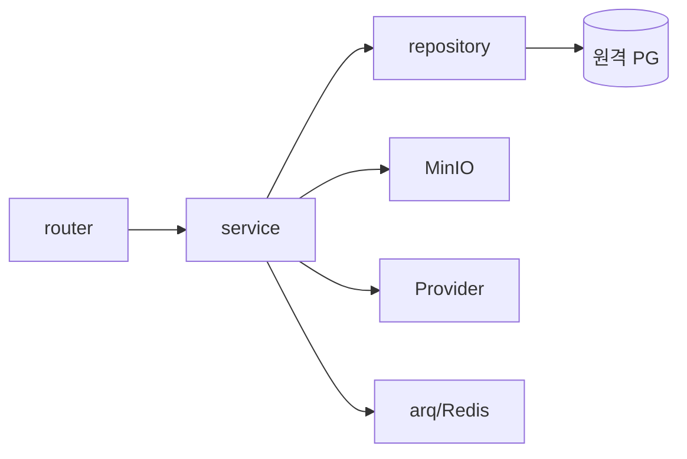
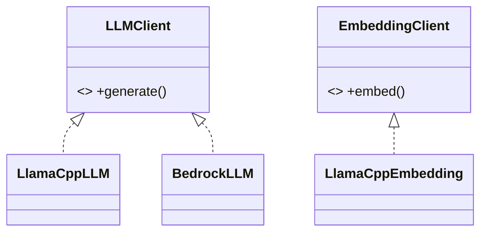

# 04. 백엔드 애플리케이션 구조 & Provider 추상화

## 1. 개요 / 범위
FastAPI 도메인 모듈 구조, 레이어링, async SQLAlchemy 와이어링, API 공통 규약, AI Provider 추상화.

## 2. 요구사항 매핑
백엔드 구조 + Provider 추상화(로컬 llama ↔ 추후 Bedrock).

## 3. 설계 결정
- 도메인 모듈(`fastapi-best-practices`) + async SA2(psycopg3).
- Provider 추상화: 비즈니스 로직은 추상 인터페이스에만 의존. **임베딩 Provider는 로컬 고정**(차원 lock-in).

## 4. 모듈 구조
```
backend/src/
├── main.py        # app factory, routers, CORS, 예외 핸들러
├── config.py      # pydantic-settings (.env)
├── database.py    # async engine + sessionmaker + get_session
├── models.py      # Base(naming_convention)
├── folders/       {router,schemas,models,service,repository,exceptions}
├── documents/     {router,schemas,models,service,repository,exceptions}
├── search/        {router,service}
├── generations/   {router,schemas,models,service}
├── storage/       {minio_client,service}
├── pipeline/      {worker,tasks}
└── ai/            {provider,llama_client,bedrock_client(추후),schemas}
```

## 5. 레이어링
`router → service → repository → model`. Pydantic 스키마 ↔ ORM 분리. 조인/집계/트리는 SQL 우선, CPU 무거운 작업(추출·임베딩·생성)은 worker로.



## 6. DB 세션 관리
```python
engine = create_async_engine(settings.DATABASE_URL)        # postgresql+psycopg
async_session = async_sessionmaker(engine, expire_on_commit=False)
async def get_session():
    async with async_session() as s:
        yield s
```
트랜잭션은 service 단위. `search_path=archive,public`(02 §7).

## 7. 설정/구성
pydantic-settings로 `.env` 로드 → 원격 PG/MinIO/Redis/llama URL·Provider 선택 주입. 환경별(dev/prod) 분리.

## 8. API 공통 규약
- 라우트: 복수 명사(`/folders`,`/documents`,`/search`,`/generations`).
- 페이지네이션: `limit`/`offset` 또는 cursor.
- 에러: 공통 에러 모델 + 도메인 예외 → 예외 핸들러가 HTTP 매핑.
- **보안:** 모든 조회/변경에 `owner_id` 스코프 강제(`WHERE owner_id=:user`).
- CORS: web 오리진 허용.

## 9. AI Provider 추상화
```python
class LLMClient(Protocol):
    async def generate(self, *, system: str, prompt: str,
                       params: DecodeParams, json_schema: dict | None = None) -> LLMResult: ...
class EmbeddingClient(Protocol):
    async def embed(self, texts: list[str]) -> list[list[float]]: ...

class LlamaCppLLM(LLMClient): ...        # LLAMA_CHAT_URL /v1/chat/completions
class LlamaCppEmbedding(EmbeddingClient): ...  # LLAMA_EMBED_URL /v1/embeddings (KURE-v1, 고정)
class BedrockLLM(LLMClient): ...         # 추후
```
- 선택: `LLM_PROVIDER`/`EMBEDDING_PROVIDER`로 팩토리 분기.
- 생성마다 `provider`/`model`/디코딩 파라미터를 계보(09)에 기록.



## 10. 구조화 출력
llama.cpp `--json-schema`(GBNF) 호출 래퍼를 ai 모듈에 공통화 — 메타 추출(07)·쿼리 파싱(08)·차트 스펙(09)에서 재사용.

## 11. 비동기 작업 연동
- `enqueue(task, **kwargs)` 인터페이스(arq). 작업 상태는 `documents.status/stage`·`generations.status`로 조회.
- 멱등 키: 인제스트=`(document_id, stage)`, 생성=`generation_id`.

## 12. 공통 횡단
- 로깅·관측: 토큰/지연 기록(계보 연동).
- 헬스체크: 원격 PG/MinIO/Redis/llama 연결 점검. 기동 시 PG/MinIO 도달 실패는 **fail-fast**(핵심 의존).

## 13. 제약·리스크
- 드라이버 일관성(psycopg3, 02·03 정합). Bedrock은 인터페이스만(MVP 구현 제외).

## 참고
`research/04 §0·§3`, `research/00 §0.2`.
