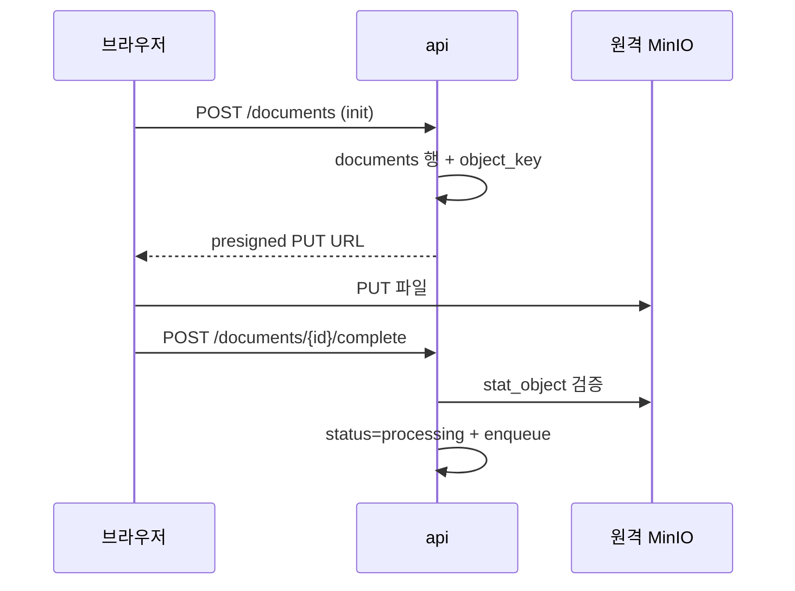

# 06. 문서 스토리지 (업로드/다운로드)

## 1. 개요 / 범위
원격 MinIO presigned 업/다운로드, object key 설계, 문서 레코드 수명주기.
**원격 MinIO만 사용**(로컬 정의 금지).

## 2. 요구사항 매핑
문서 업로드/다운로드/삭제, 대용량(스캔 PDF) 직접 전송.

## 3. 설계 결정
- presigned PUT/GET로 **브라우저 ↔ MinIO 직접 전송**(서버 프록시 회피).
- object key `docs/{uuid}` — 폴더 경로와 분리(폴더 MOVE/rename이 오브젝트 불변).
- **엔드포인트 단일화:** 원격 공인 IP라 서버·브라우저 동일 URL(research의 internal/public 분리 불필요).

## 4. 업로드 시퀀스
1. **Init** `POST /documents` `{folder_id, filename, size, mime}` → `documents` 행(status=uploaded) + `object_key=docs/{uuid}` + **presigned PUT(짧은 TTL)** 반환.
2. **Upload** 브라우저 → MinIO 직접 PUT.
3. **Confirm** `POST /documents/{id}/complete` → `stat_object` 검증(존재/크기) → status=processing → arq 인제스트 enqueue.

## 5. 다운로드
`GET /documents/{id}/download` → presigned GET 반환(Content-Disposition에 한국어 원본명 RFC 5987 인코딩) → 브라우저 직접 fetch.

### 5.1 문서 API 계약 (전체)
> 1.4 프론트 관점 점검에서 보강: 기존 본문은 업로드/다운로드만 기술했고 **목록·상세·편집·삭제 엔드포인트가 누락**되어 추가(DocumentList/Detail·MetadataEditor·삭제 동선 필수).

| 메서드 | 경로 | 설명 |
|---|---|---|
| GET | `/documents?folder_id=&limit=&cursor=` | 폴더 내 문서 목록(페이지네이션) — DocumentList(10 §8) |
| GET | `/documents/{id}` | 문서 상세(메타 + `status`/`stage`/`error`) — DocumentDetail·폴링(07 §12) |
| POST | `/documents` | **Init**: `{folder_id, filename, size, mime}` → `uploaded` 행 + presigned PUT(§4) |
| POST | `/documents/{id}/complete` | **Confirm**: `stat_object` 검증 → `processing` + 인제스트 enqueue(§4·§8) |
| PATCH | `/documents/{id}` | 메타 편집(`{llm_title,llm_summary,topics,keywords}`, 07 §9) / 이동(`{folder_id}`) |
| DELETE | `/documents/{id}` | 삭제 수명주기(§9): `object_key` 수집 → DB CASCADE → worker MinIO 삭제 |
| GET | `/documents/{id}/download` | presigned GET 발급 — **발급 전 `owner_id` 검사**(§10, §5) |

에러: 권한 외 404, 형제/이동 충돌은 상위 폴더 정책 준수(05 §8), Confirm 검증 실패 4xx. 모든 쿼리 `owner_id` 강제(04 §8).

## 6. object key 설계
`docs/{uuid}`. 폴더 멤버십·표시명은 PG가 보유 → 폴더 이동/이름변경이 MinIO를 건드리지 않음.

## 7. MinIO 클라이언트
원격 `endpoint=49.247.14.186:9000`, `secure=False`, `.env` 자격증명, bucket `document-archive-refine`. 부트 시 버킷 보장. presign TTL 짧게(예: 5~15분).

## 8. 검증·무결성
- Confirm 시 size/mime 확인, 인제스트 중 sha256 계산.
- 멱등: 중복 Confirm 안전(이미 processing/ready면 무시).
- 고아 오브젝트(Init 후 Upload 미완) → TTL 만료 + 주기적 정리 잡.

## 9. 삭제 수명주기
문서 삭제: ① `object_key` 확보 → ② DB 삭제(청크·계보 CASCADE) → ③ worker가 MinIO 오브젝트 삭제. 실패 시 재시도(삭제 잡 멱등).

## 10. 보안 고려사항
presigned 패턴은 표준이나, 본 배포(원격 MinIO·**http(비TLS)**·공인 IP)에서는 실제 위험이 있어 별도 관리한다.

### 10.1 위험
- **링크 유출 = 권한 유출:** presigned URL은 서명만 맞으면 통과 → 로그·히스토리·Referer로 새면 TTL 동안 누구나 업/다운로드. 발급 후엔 앱 인증·`owner_id` 검사를 우회.
- **🔴 평문 전송(http):** presigned URL과 **파일 본문이 평문** → 네트워크 경로에서 URL 스니핑·재사용, 민감 문서(예: 연봉계약서) 내용 탈취 가능. **현재 구성의 최대 위험.**
- **공인 IP 노출:** MinIO가 인터넷에서 직접 도달 → 공격 표면 큼.
- **자격증명 노출:** `.env`가 새면 버킷 전체 접근. 약한 키 위험.
- **업로드 변조:** 서명에 크기/타입 조건이 없으면 선언과 다른/더 큰 파일 업로드 가능.

### 10.2 완화책
| 위험 | 완화 |
|---|---|
| 평문 전송(http) | **운영 전 TLS 적용 필수**(MinIO 앞 https 종단/리버스 프록시) 또는 VPN·내부망 한정 |
| 공인 IP 노출 | 방화벽 출처 IP 제한, 버킷 정책 최소권한 |
| 링크 유출 | TTL 5~15분, **발급 시 `owner_id` 검사**, 로그에 URL 미기록 |
| 업로드 변조 | presigned PUT 서명에 `Content-Length`/`Content-Type` 조건 포함 + Confirm `stat_object` 검증 |
| 자격증명 | 강한 키 교체, `.env`는 `.gitignore`, 앱 전용 액세스키 분리 |

> **다운로드 권한:** `/documents/{id}/download`는 presigned GET 발급 **전에 반드시 `owner_id` 검사**(발급 후 URL은 앱 인증을 우회하므로).

## 11. 제약·리스크
`stat_object`로 실제 크기 검증(클라이언트 보고 불신). 고아 오브젝트 정리 잡(§8).

## 참고
`research/04 §2`. 인프라 보안은 [02 §12](./02-infrastructure-and-environment.md).
