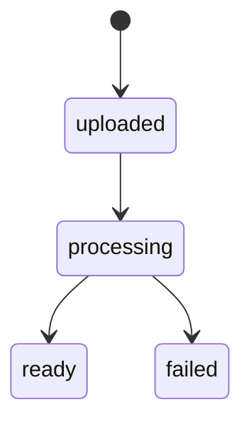
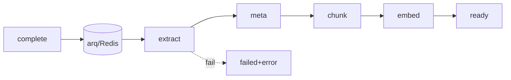

# 07. 문서 처리 파이프라인 (인제스트)

## 1. 개요 / 범위
업로드 확정 후 **추출 → 메타 → 청킹 → 임베딩 → 저장**의 비동기 파이프라인. 원본=원격 MinIO, 결과=원격 PG.

## 2. 요구사항 매핑
텍스트 추출 / OCR / 메타데이터 / 임베딩.

## 3. 설계 결정
- **arq + Redis**(BackgroundTasks 제외 — 상태추적·내구성).
- PDF 추출 **pypdf(BSD) + pdfplumber(MIT) 표 보강**, PyMuPDF는 AGPL로 제외.
- 임베딩 **KURE-v1 1024d 로컬 고정**(`--pooling cls`, 출력 L2 정규화됨 → 이중 정규화 금지).

## 4. 상태/스테이지
`status: uploaded→processing→ready|failed`, `stage: extracting→generating_meta→chunking→embedding`. **각 stage 멱등·재시작.**

## 5. 파일 타입 감지
magic bytes(`filetype`/`python-magic`)로 PDF/이미지/TXT/MD 라우팅(확장자 불신).

## 6. PDF 추출
- 기본 텍스트: **pypdf** `extract_text()`. 표/복잡 레이아웃: **pdfplumber** 보강(Markdown 표 직렬화).
- 페이지별 스캔 판별: `len(extract_text().strip()) < THRESHOLD` + `page.images` 유무.
- OCR 입력: `page.images` 추출 또는 **pdf2image(Poppler)** 풀페이지 렌더 → §7.

## 7. OCR
PaddleOCR PP-OCRv5(기본) → Tesseract `kor`(폴백) → (선택) Qwen2.5-VL(어려운 페이지, llama-swap 온디맨드). 페이지 단위·타임아웃·재시도, 부분 실패 격리.

## 8. TXT / MD
- TXT 인코딩: charset-normalizer, **EUC-KR→CP949 안전 디코딩**(상위집합), 크래시 금지.
- MD: 구조 보존(헤더 인지 청킹), 평문화 금지.

## 9. 메타데이터 생성
- intrinsic: pypdf/Tika(page_count·author·날짜).
- NLP: 언어감지·키워드.
- LLM: `--json-schema`로 `{title,summary,topics[],keywords[]}` — MVP는 읽기 전용 표시(사용자 보정 제외, research/01 §8 / 10 §7a).

## 10. 청킹
재귀 분할 **512토큰/64오버랩**(실제 토크나이저로 측정), 표는 원자 단위(행 중간 분할 금지). (선택) Contextual Retrieval prefix.

## 11. 임베딩 & 저장
KURE-v1로 청크 임베딩(1024d) → `archive.document_chunks` insert. 멱등: `UNIQUE(document_id, chunk_index)` upsert.

## 12. 오케스트레이션 (arq)

- 진행 보고: `status/stage` 갱신 → 프론트 react-query 폴링(ready/failed 정지).
- 페이지/스테이지 멱등·백오프 재시도, 한 페이지 실패가 문서 전체 중단 안 함.
- **소요 시간:** 파이프라인 시작~`ready`까지 경과를 `documents.ingest_ms`(03 §5)에 기록 → 메타데이터 패널에 표시(10 §11, 성능 측정용). (AI 산출물 문서는 생성 소요 `generations.latency_ms` 사용, 09 §9a.)

## 13. 제약·리스크
- pypdf 추출 품질(복잡 레이아웃) → pdfplumber 병용 기본화.
- pdf2image는 Poppler 설치 필요.
- 임베딩 차원 1024 고정(변경 시 전량 재임베딩).

## 참고
`research/01` 전반, `research/04 §4`.
