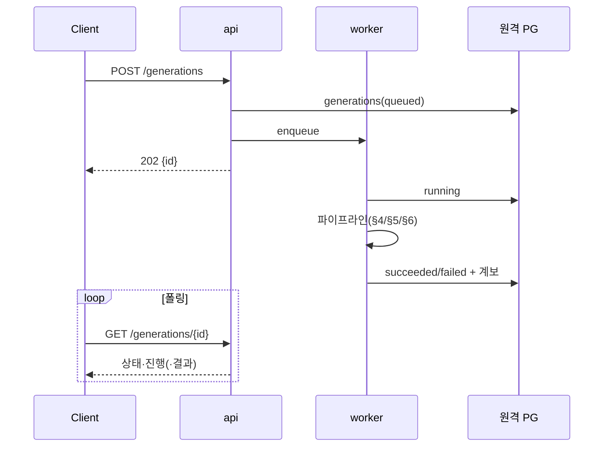

# 09. AI 산출물 & 계보(Lineage)

## 1. 개요 / 범위
요약/초안/보고서 워크플로우, 차트 생성, 계보 데이터 모델, 비동기 생성 작업.
계보는 원격 PG 저장, 생성은 Provider 추상화(04 §9)로 실행하며 provider/model 스냅샷 기록.

## 2. 요구사항 매핑
AI 산출물 워크플로우 / 계보 메타데이터.

## 3. 설계 결정
- 차트는 **Vega-Lite 선언형**(코드 실행 X), **산술은 Python**(LLM에 시키지 않음).
- 계보 **행 단위 스냅샷**(W3C PROV/Langfuse 정렬), 인용 `[n]↔chunk_id`.

## 4. Summary 워크플로우
길이 분기:
```
doc_tokens ≤ 0.6*ctx → STUFF (1콜)
doc_tokens > 0.6*ctx → MAP-REDUCE (청크 요약→통합)
> ~50 청크          → HIERARCHICAL (섹션 그룹 재귀)
```
청크 미니요약 + 문서 최종요약 2단 저장, `[n]` 인용.

## 5. Draft 워크플로우
**outline-then-expand**: ① 요약들로 개요 제안 → ② 사용자 개요 편집 → ③ 섹션별 관련 청크 검색·생성(`[n]` 인용) → ④ 조립·일관성 패스. 템플릿(보고서/제안서/공문/메모) 선택.

## 6. Report 워크플로우
① LLM 구조화 데이터 추출(rows) → ② **Python이 통계 결정적 계산** → ③ LLM Vega-Lite 스펙 생성 → ④ JSON 스키마 검증·수리 루프(≤5회) → ⑤ react-vega 렌더 + 서사(`[n]` 인용).

## 7. 계보 데이터 모델
`generations`(헤드) + `generation_prompts`/`source_documents`/`source_chunks`/`charts` + `models`/`prompt_templates`. DDL은 [03 §5](./03-data-model-and-migrations.md). 한 생성=`generations` 한 행, 하위 테이블이 출처·프롬프트·차트를 연결.

## 8. 재현성
저장: `seed` + 디코딩 파라미터(temperature/top_p/top_k) + 렌더된 프롬프트 + 모델 파일 해시 + `provider`(+Bedrock이면 model id/region). 동일 조건 재실행 가능. 로컬↔Bedrock 이식성 확보.

## 9. 비동기 생성 작업
**왜 비동기:** LLM 호출은 수십 초~수 분 → 동기 처리 시 타임아웃·재시도 중복 생성. api는 큐에 넣고 즉시 202, 무거운 작업은 worker(arq), 클라이언트는 폴링.



**흐름:**
1. `POST /generations` → api가 `generations` 헤드 행을 **`queued`로 먼저 기록**(이 시점에 생성 ID 확정, §7).
2. arq enqueue 후 **즉시 `202 {id}`** 반환(§10).
3. worker가 픽업 → **`running`** → 파이프라인 실행(§4 Summary/§5 Draft/§6 Report) → **`succeeded`/`failed`** 갱신 + 계보(출처·프롬프트·provider/model/seed·차트) 기록(§7·§8) + **산출물을 문서로 materialize(§9a)**.
4. 클라이언트가 `GET /generations/{id}` **폴링**으로 진행 표시(프론트 "산출물 내역" 패널, [10](./10-frontend-drive-ui.md) §11 연동).

**상태:** `queued → running → succeeded | failed`.

## 9a. 산출물의 문서화 (materialization) — 1급 문서
AI 산출물(요약/초안/보고서)은 `generations.output_text`로만 두지 않고 **일반 문서와 동일하게 `documents` 행 + MinIO 오브젝트로 저장**한다(10 §11, 1.13.5). 이로써 산출물은 **Center 목록 노출·검색·RAG 대상**이 된다(08은 `documents`/`document_chunks` 기준이라 별도 처리 없이 포함).
- `succeeded` 시 worker가 산출물(요약/초안/보고서=Markdown; report는 차트 spec 포함)을 오브젝트로 업로드하고 `documents` 행 생성 → **인제스트(청킹·임베딩)까지 수행**(검색/RAG 가능). `generations.output_document_id`에 결과 문서 id 기록(03 §5).
- **폴더 위치:** 기본 **원본(주 source) 문서와 동일 폴더**(정책 추후 확정 — 전용 "산출물" 하위 폴더 옵션 가능).
- **"산출물 내역"(원본 기준 목록):** `generation_source_documents.role='source'`로 원본과 연결된 생성 중 **`output_document_id`가 존재(NOT NULL)** 하는 것만 표시. row 클릭 → Center가 그 출력 문서의 폴더로 이동·선택(10 §11).
- **삭제 정합:** Center에서 출력 문서 삭제 → `output_document_id` **`ON DELETE SET NULL`**(03 §5) → 해당 생성은 "산출물 내역"에서 자동 비노출(계보 헤드 행 자체는 감사 목적 유지).

- **queued 선기록 이유:** ID 즉시 발급으로 폴링 대상 확보, 작업 유실 시에도 추적 가능.
- **멱등:** worker 작업은 멱등 키로 중복 enqueue 안전 처리(06 Confirm과 동일 패턴).
- **재현성 연결:** `succeeded` 시 provider/model/seed/렌더 프롬프트 스냅샷 필수 → 누락 시 재현 불가(§8·§11).

## 10. API 계약
| 메서드 | 경로 | 설명 |
|---|---|---|
| POST | `/generations` | `{kind, document_ids, options}` → 202 `{id}` |
| GET | `/generations/{id}` | 상태·진행·결과(`output_document_id`·`latency_ms` 포함) |
| GET | `/generations/{id}/lineage` | 출처/프롬프트/차트 전체 — **산출물 문서 인스펙터의 계보 섹션**에 표시(부모 문서 링크·프롬프트·모델/seed·인용, 10 §7a) |
| GET | `/generations?source_document_id=&kind=&user=` | **"산출물 내역"** — 원본 문서 기준, `output_document_id` 존재 건만(§9a) |

## 11. 제약·리스크
provider/model/seed 누락 시 재현 불가(기록 강제), 차트 수리 루프 한도(≤5회) 후 실패 처리, 장문 요약 지연/메모리.

## 참고
`research/03` 전반.
