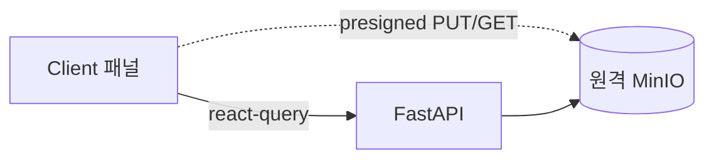

# 10. 프론트엔드 (3-Panel Drive UI)

## 1. 개요 / 범위
Next.js 16/React 19 기반 3패널 Drive UI. 서버/클라이언트 분리, 데이터·상태 관리, 컴포넌트, 반응형.

## 2. 요구사항 매핑
3-Panel 레이아웃, 폴더/문서 CRUD, 업/다운로드, 검색·AI 산출물 UI. **라이트/다크 테마, PC/태블릿/모바일 3단 반응형.**

## 3. 설계 결정
- react-query 1차 데이터 레이어 + Zustand UI 상태, RSC 셸 + Client 패널.
- 파일 업/다운로드는 원격 MinIO presigned 직접 호출(06). API는 `NEXT_PUBLIC_API_URL` 주입.
- **테마: `next-themes` + Tailwind `dark:` / shadcn CSS 변수 토큰.** 시스템 설정 추종 + 수동 토글, 토큰은 라이트/다크 듀얼 정의. RSC FOUC 방지(`suppressHydrationWarning`).
- **반응형: PC/태블릿/모바일 3단**(Tailwind `lg`/`md` 기준). 상세는 §12.

## 4. 전체 레이아웃 컴포넌트 맵 (우선 구상)
세부 설계 전에 컴포넌트 트리·책임·상태 소유를 먼저 확정.
```
AppShell (RSC)
├─ ResizablePanels (client)
│  ├─ LeftPanel: FolderTree (client)            # 상태: 선택/확장(Zustand)
│  ├─ CenterPanel
│  │  ├─ DocumentList (client)                  # 데이터: react-query
│  │  ├─ UploadDropzone (client)                # presigned PUT
│  │  └─ DocumentDetail (client)
│  └─ RightPanel
│     ├─ MetadataEditor (client)
│     └─ GenerationHistory (client)             # AI 생성 이력
└─ SearchBar / AskDialog (client)               # 검색·RAG
```
| 컴포넌트 | 종류 | 데이터/상태 |
|---|---|---|
| AppShell | RSC | 초기 트리·목록 패치(Suspense) |
| FolderTree | client | react-query(트리) + Zustand(선택/확장) |
| DocumentList/Detail | client | react-query |
| UploadDropzone | client | presigned 3단계 |
| MetadataEditor | client | react-query mutation |
| GenerationHistory | client | react-query 폴링 |

## 5. 서버/클라이언트 분리
RSC: 페이지 셸·초기 패치(패널별 Suspense 스트리밍). Client(`"use client"`): 트리/드롭존/메타 편집 등 고상호작용.

## 6. 데이터 레이어
react-query(목록/상세/트리 + 파이프라인·생성 폴링 + 캐시·낙관 업데이트). RSC 초기 렌더는 `HydrationBoundary`로 시드. Server Actions는 선택(FastAPI와 로직 중복 금지).

## 7. UI 상태
선택/확장은 Zustand(또는 context). 트리는 평면 리스트(05)에서 `useMemo` 구성. 낙관 업데이트 후 실패 시 롤백.

## 8. 3패널 구성
- **Left:** 폴더 트리 + CRUD/MOVE(드래그).
- **Center:** 문서 목록/상세, 업로드/다운로드/삭제/이동.
- **Right:** 선택 폴더·문서 메타데이터 + AI 생성 이력 요약(09).

## 9. 컴포넌트 선정·커스터마이징 전략
컴포넌트 구현 시 **shadcn/ui MCP로 적합한 컴포넌트를 탐색·선정**하고, 자세한 커스터마이징은 **Tailwind CSS**로 진행. 기본 빌딩블록: Resizable(react-resizable-panels), tree-view(shadcn-tree-view), dropzone(shadcn-dropzone)→presigned PUT, Lucide 아이콘.

## 10. 업로드/다운로드 UX
presigned 3단계(06) 연동, 진행률 표시, 인제스트 `status/stage` 폴링(ready/failed 정지).

## 11. 검색·AI 산출물 UI
검색 입력(키워드/자연어), 결과·인용 클릭 → 원문 딥링크. 요약/초안/보고서 생성·이력 패널(08/09 연동).

## 12. 반응형 (PC/태블릿/모바일)
- **PC·태블릿(`≥md` 768+):** 3패널 동시 노출(Left/Center/Right) + ResizablePanels. 태블릿은 PC와 동일 3패널(패널 폭만 축소).
- **모바일(`<md` <768):** 단일 패널 + Sheet/Drawer(좌 트리·우 메타).

패널별 독립 스트리밍. 테마(라이트/다크)는 모든 브레이크포인트 공통(§3).

## 13. 다이어그램


## 14. 제약·리스크
브라우저→원격 MinIO presigned 호출 시 **버킷 CORS 설정** 필요. API 계약(05~09) 확정 후 작성. 폴링 주기 조정.

## 참고
`research/04 §5`.
