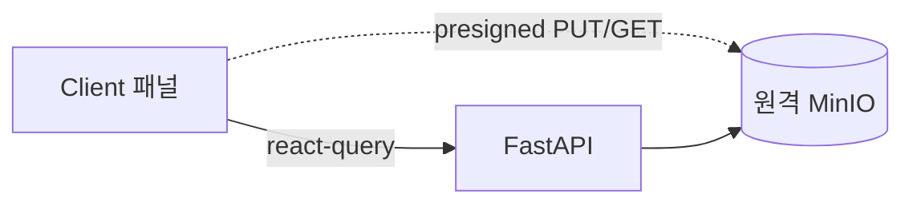

# 10. 프론트엔드 (3-Panel Drive UI)

## 1. 개요 / 범위
Next.js 16/React 19 기반 3패널 Drive UI. 서버/클라이언트 분리, 데이터·상태 관리, 컴포넌트, 반응형.

## 2. 요구사항 매핑
3-Panel 레이아웃, 폴더/문서 CRUD, 업/다운로드, 검색·AI 산출물 UI. **라이트/다크 테마, PC/태블릿/모바일 3단 반응형.**

## 3. 설계 결정
- react-query 1차 데이터 레이어 + Zustand UI 상태, RSC 셸 + Client 패널.
- 파일 업/다운로드는 원격 MinIO presigned 직접 호출(06). API는 `NEXT_PUBLIC_API_URL` 주입.
- **테마: `next-themes` + Tailwind `dark:` / shadcn CSS 변수 토큰.** 시스템 설정 추종 + 수동 토글, 토큰은 라이트/다크 듀얼 정의. RSC FOUC 방지(`suppressHydrationWarning`).
- **반응형: PC/태블릿/모바일 3단**(Tailwind `lg`/`md` 기준). 상세는 §12.

## 4. 전체 레이아웃 컴포넌트 맵 (우선 구상)
세부 설계 전에 컴포넌트 트리·책임·상태 소유를 먼저 확정.
```
ThemeProvider (next-themes, attribute="class" defaultTheme="system" enableSystem)   # §3
└─ AppShell (RSC)
   ├─ AppHeader (client)                          # SearchBar + ThemeToggle(light/dark/system)
   │  ├─ SearchBar → SearchResults (client)       # 검색·결과, 인용 클릭 딥링크(§11)
   │  └─ AskDialog (client)                       # RAG 질의(Dialog)
   ├─ ResizablePanels (client, ≥md)               # 모바일(<md)은 단일 패널로 대체(§12)
   │  ├─ LeftPanel: FolderTree (client)           # 상태: 선택/확장(Zustand). 모바일=Sheet
   │  ├─ CenterPanel
   │  │  ├─ DocumentList (client)                 # 데이터: react-query
   │  │  ├─ UploadDropzone (client)               # presigned PUT
   │  │  └─ DocumentDetail (client)               # status/stage 폴링 표시
   │  └─ RightPanel                               # 모바일=Drawer
   │     ├─ MetadataEditor (client)
   │     ├─ GenerationTrigger (client)            # 요약/초안/보고서 생성 시작(Dialog)
   │     └─ GenerationHistory (client)            # AI 생성 이력·폴링
   └─ Toaster (sonner, client)                    # 업로드/인제스트/생성 완료·실패 알림
```
| 컴포넌트 | 종류 | 데이터/상태 |
|---|---|---|
| ThemeProvider | client | next-themes(라이트/다크/시스템), FOUC 방지(§3) |
| AppShell | RSC | 초기 트리·목록 패치(Suspense) |
| AppHeader/ThemeToggle | client | 테마 토글(로컬), 검색 입력 |
| FolderTree | client | react-query(트리) + Zustand(선택/확장) |
| DocumentList/Detail | client | react-query(목록/상세 + status/stage 폴링) |
| UploadDropzone | client | presigned 3단계 |
| MetadataEditor | client | react-query mutation |
| GenerationTrigger | client | react-query mutation(POST /generations, 202) |
| GenerationHistory | client | react-query 폴링 |
| SearchBar/SearchResults/AskDialog | client | react-query(POST /search·/search/ask) |
| Toaster | client | sonner(전역 알림) |

> **반응형 합성(§12):** `≥md`는 `ResizablePanels` 3패널, `<md`는 CenterPanel 단일 + Left=`Sheet`/Right=`Drawer`. 동일 컴포넌트를 컨테이너만 바꿔 재사용.

## 5. 서버/클라이언트 분리
RSC: 페이지 셸·초기 패치(패널별 Suspense 스트리밍). Client(`"use client"`): 트리/드롭존/메타 편집 등 고상호작용.

## 6. 데이터 레이어
react-query(목록/상세/트리 + 파이프라인·생성 폴링 + 캐시·낙관 업데이트). RSC 초기 렌더는 `HydrationBoundary`로 시드. Server Actions는 선택(FastAPI와 로직 중복 금지).

## 7. UI 상태
선택/확장은 Zustand(또는 context). 트리는 평면 리스트(05)에서 `useMemo` 구성. 낙관 업데이트 후 실패 시 롤백.

**소유 경계 확정(1.3 검증):**
- **Zustand(클라이언트 UI 상태):** `selectedFolderId`, `selectedDocumentId`, 폴더 확장 집합(`expandedFolderIds`), 모바일 Sheet/Drawer 개폐, 검색 입력값/모드(`q`,`mode`). 이 선택 상태가 **react-query 쿼리 키를 구동**(예: `["documents", selectedFolderId]`).
- **react-query(서버 데이터):** 트리·목록·상세·검색 결과·생성 이력 + 파이프라인/생성 폴링. 캐시·낙관 업데이트·무효화 담당.
- **next-themes:** 라이트/다크/시스템 테마 — Zustand에 두지 않음(§3, 자체 persistence·SSR 처리).
- 경계 원칙: **서버가 출처면 react-query, 클라이언트 전용(선택/토글/입력)이면 Zustand.** 서버 데이터를 Zustand로 복제 금지.

## 8. 3패널 구성
- **Left:** 폴더 트리 + CRUD/MOVE(드래그).
- **Center:** 문서 목록/상세, 업로드/다운로드/삭제/이동.
- **Right:** 선택 폴더·문서 메타데이터 + AI 생성 이력 요약(09).

## 9. 컴포넌트 선정·커스터마이징 전략
컴포넌트 구현 시 **shadcn/ui MCP로 적합한 컴포넌트를 탐색·선정**하고, 자세한 커스터마이징은 **Tailwind CSS**로 진행. 기본 빌딩블록: Resizable(react-resizable-panels), tree-view(shadcn-tree-view), dropzone(shadcn-dropzone)→presigned PUT, Lucide 아이콘.

## 10. 업로드/다운로드 UX
presigned 3단계(06) 연동, 진행률 표시, 인제스트 `status/stage` 폴링(ready/failed 정지).

## 11. 검색·AI 산출물 UI
검색 입력(키워드/자연어), 결과·인용 클릭 → 원문 딥링크. 요약/초안/보고서 생성·이력 패널(08/09 연동).

## 12. 반응형 (PC/태블릿/모바일)
- **PC·태블릿(`≥md` 768+):** 3패널 동시 노출(Left/Center/Right) + ResizablePanels. 태블릿은 PC와 동일 3패널(패널 폭만 축소).
- **모바일(`<md` <768):** 단일 패널 + Sheet/Drawer(좌 트리·우 메타).

패널별 독립 스트리밍. 테마(라이트/다크)는 모든 브레이크포인트 공통(§3).

## 13. 다이어그램


## 14. 제약·리스크
브라우저→원격 MinIO presigned 호출 시 **버킷 CORS 설정** 필요. API 계약(05~09) 확정 후 작성. 폴링 주기 조정.

## 참고
`research/04 §5`.
