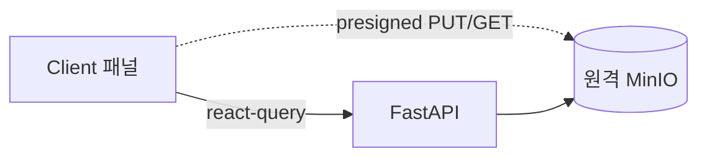

# 10. 프론트엔드 (3-Panel Drive UI)

## 1. 개요 / 범위
Next.js 16/React 19 기반 3패널 Drive UI. 서버/클라이언트 분리, 데이터·상태 관리, 컴포넌트, 반응형.
- **제품(앱) 표기명: `Mechive`** — 브라우저 타이틀(`<title>`/메타데이터)·헤더 브랜드에 사용. (저장소/서비스 식별자 `document-archive-refine`·MinIO 버킷명은 변경하지 않음 — 표시명만.)

## 2. 요구사항 매핑
3-Panel 레이아웃, 폴더/문서 CRUD, 업/다운로드, 검색·AI 산출물 UI. **라이트/다크 테마, PC/태블릿/모바일 3단 반응형.**

## 3. 설계 결정
- react-query 1차 데이터 레이어 + Zustand UI 상태, RSC 셸 + Client 패널.
- 파일 업/다운로드는 원격 MinIO presigned 직접 호출(06). API는 `NEXT_PUBLIC_API_URL` 주입.
- **테마: `next-themes` + Tailwind `dark:` / shadcn CSS 변수 토큰.** 시스템 설정 추종 + 수동 토글, 토큰은 라이트/다크 듀얼 정의. RSC FOUC 방지(`suppressHydrationWarning`).
- **반응형: PC/태블릿/모바일 3단**(Tailwind `lg`/`md` 기준). 상세는 §12.

## 4. 전체 레이아웃 컴포넌트 맵 (우선 구상)
세부 설계 전에 컴포넌트 트리·책임·상태 소유를 먼저 확정.
```
ThemeProvider (next-themes, attribute="class" defaultTheme="system" enableSystem)   # §3
└─ AppShell (RSC)                                 # 브랜드명 "Mechive"(§1)
   ├─ AppHeader (client)                          # SearchBar + ThemeToggle(light/dark/system)
   │  ├─ SearchBar → SearchResults (client)       # 검색·결과, 인용 클릭 딥링크(§11)
   │  └─ AskDialog (client)                       # RAG 질의(Dialog)
   ├─ ResizablePanels (client, ≥md)               # 모바일(<md)은 단일 패널로 대체(§12)
   │  ├─ LeftPanel: FolderTree (client)           # 상태: 선택/확장(Zustand). 모바일=Sheet
   │  │  └─ FolderActions (per-folder "⋯" DropdownMenu): 이동/이름변경/삭제  # §8a
   │  ├─ CenterPanel                              # 문서 "목록" 전용(하단 상세 패널 제거)
   │  │  ├─ UploadDropzone (client)               # presigned PUT
   │  │  └─ DocumentList (client)                 # 데이터: react-query, row "⋯" 액션
   │  └─ RightPanel = DetailInspector             # 토글형(§8b). 모바일=Drawer
   │     ├─ DocumentDetail (client)               # status/stage 폴링 + "원본 보기" 버튼(§10)
   │     ├─ MetadataView (client)                 # AI 메타 읽기 전용 표시(§7a, 보정 MVP 제외)
   │     ├─ GenerationTrigger (client)            # 요약/초안/보고서 생성 시작(Dialog)
   │     └─ GenerationHistory (client)            # AI 생성 이력·폴링
   ├─ Dialogs (client, 모바일 풀스크린 §12)
   │  ├─ NewFolderDialog       (이름 입력)                 # §8a
   │  ├─ RenameFolderDialog    (이름 입력)                 # §8a
   │  ├─ MoveFolderDialog      (트리 표현 + 대상 상위 폴더 선택)  # §8a, MOVE=05 §6
   │  ├─ DeleteConfirm         (alert-dialog, 재귀 삭제 경고)
   │  └─ OriginalViewerDialog  (텍스트류=마크다운 뷰어; 그 외=다운로드, 다이얼로그 없음) # §10
   └─ Toaster (sonner, client)                    # 업로드/인제스트/생성 완료·실패 알림
```
| 컴포넌트 | 종류 | 데이터/상태 |
|---|---|---|
| ThemeProvider | client | next-themes(라이트/다크/시스템), FOUC 방지(§3) |
| AppShell | RSC | 초기 트리·목록 패치(Suspense), 브랜드 "Mechive" |
| AppHeader/ThemeToggle | client | 테마 토글(로컬), 검색 입력 |
| FolderTree + FolderActions | client | react-query(트리) + Zustand(선택/확장), "⋯" 드롭다운(이동/이름변경/삭제) |
| DocumentList | client | react-query(목록 + status/stage 폴링), row 선택·"⋯" 액션 |
| UploadDropzone | client | presigned 3단계 |
| DetailInspector(RightPanel) | client | **토글형** — row 선택 또는 row "⋯" 클릭 시에만 노출(§8b) |
| DocumentDetail | client | status/stage + 원본 보기(§10). 미리보기 영역 없음 |
| MetadataView | client | react-query(읽기 전용), AI 메타 표시(§7a). 보정 MVP 제외 |
| GenerationTrigger | client | react-query mutation(POST /generations, 202) |
| GenerationHistory | client | react-query 폴링 |
| NewFolder/Rename/MoveFolderDialog | client | 05 §8(POST/PATCH), Move=트리 선택 UI |
| SearchBar/SearchResults/AskDialog | client | react-query(POST /search·/search/ask) |
| Toaster | client | sonner(전역 알림) |

> **반응형 합성(§12):** `≥md`는 `ResizablePanels` 2패널(Left 트리 / Center 목록) + 토글형 Right 인스펙터, `<md`는 CenterPanel 단일 + Left=`Sheet`/Right=`Drawer`. **모든 다이얼로그는 모바일에서 전체 화면**. 동일 컴포넌트를 컨테이너만 바꿔 재사용.

## 5. 서버/클라이언트 분리
RSC: 페이지 셸·초기 패치(패널별 Suspense 스트리밍). Client(`"use client"`): 트리/드롭존/다이얼로그/인스펙터 토글 등 고상호작용.

## 6. 데이터 레이어
react-query(목록/상세/트리 + 파이프라인·생성 폴링 + 캐시·낙관 업데이트). RSC 초기 렌더는 `HydrationBoundary`로 시드. Server Actions는 선택(FastAPI와 로직 중복 금지).

## 7. UI 상태
선택/확장은 Zustand(또는 context). 트리는 평면 리스트(05)에서 `useMemo` 구성. 낙관 업데이트 후 실패 시 롤백.

**소유 경계 확정(1.3 검증):**
- **Zustand(클라이언트 UI 상태):** `selectedFolderId`, `selectedDocumentId`, 폴더 확장 집합(`expandedFolderIds`), 모바일 Sheet/Drawer 개폐, 검색 입력값/모드(`q`,`mode`). 이 선택 상태가 **react-query 쿼리 키를 구동**(예: `["documents", selectedFolderId]`).
- **react-query(서버 데이터):** 트리·목록·상세·검색 결과·생성 이력 + 파이프라인/생성 폴링. 캐시·낙관 업데이트·무효화 담당.
- **next-themes:** 라이트/다크/시스템 테마 — Zustand에 두지 않음(§3, 자체 persistence·SSR 처리).
- 경계 원칙: **서버가 출처면 react-query, 클라이언트 전용(선택/토글/입력)이면 Zustand.** 서버 데이터를 Zustand로 복제 금지.

### 7a. 메타데이터 표시(읽기 전용 — MVP)
문서 본문은 본 웹앱에서 편집하지 않는다(읽기 전용 보관함). **AI가 추출한 메타데이터(제목/요약/토픽/키워드)도 MVP에서는 보정 기능 없이 그대로(읽기 전용) 표시**한다 — input/저장 없음. (오입력 메타를 사람이 직접 입력해 보정할지, AI 프롬프트로 보정할지는 **추후 결정**. 타 서비스 사례·설계 옵션은 `research/01-document-processing.md §8` 기록.)

## 8. 패널 구성 (Left 트리 / Center 목록 / Right 토글 인스펙터)
- **Left:** 폴더 트리 + CRUD/MOVE. 각 폴더 행에 **"⋯" 드롭다운**(§8a).
- **Center:** 문서 **목록 전용** + 업로드. (기존 하단 DocumentDetail 패널 제거 — 상세는 Right로 통합.)
- **Right = DetailInspector(토글형 §8b):** 선택 문서 상세(status/stage·원본 보기 §10) + 메타데이터 표시(읽기 전용 §7a) + AI 생성 트리거/이력(09). Center·Right 간 기능 중복 없음(상세는 Right에만).

### 8a. 폴더 액션 & 폴더 다이얼로그
- **폴더 "⋯" DropdownMenu**(각 폴더 행): **이동 / 이름 변경 / 삭제**. (참고 UX: shadcn sidebar-demo의 행별 액션 메뉴.) 트리 상단/루트엔 **"새 폴더"** 진입점.
- **NewFolderDialog:** 이름 입력 → `POST /folders {parent_id?, name}`(05 §8). 형제 중복명 409 인라인 표기.
- **RenameFolderDialog:** 이름 입력(현재명 pre-fill) → `PATCH /folders/{id} {name}`(05 §8).
- **MoveFolderDialog:** **폴더 트리 구조를 표현**하고 **옮길 대상 상위 폴더를 선택** → `PATCH /folders/{id} {parent_id}`(05 §6 MOVE). 자기 자신·후손은 선택 비활성(사이클 방지 422 사전 차단).

### 8b. Right 인스펙터 토글 규칙
Right 패널은 **항상 노출이 아니라 토글**한다 — **문서 row를 클릭해 선택**했거나 **row의 "⋯" 버튼을 클릭**한 경우에만 열린다(선택 해제/닫기 시 접힘). 상태는 `selectedDocumentId`(Zustand §7)로 구동. `≥md`는 인스펙터 패널 펼침/접힘, `<md`는 Drawer 개폐(§12).

## 9. 컴포넌트 선정·커스터마이징 전략
컴포넌트 구현 시 **shadcn/ui MCP로 적합한 컴포넌트를 탐색·선정**하고, 자세한 커스터마이징은 **Tailwind CSS**로 진행. 기본 빌딩블록: Resizable(react-resizable-panels), tree-view(shadcn-tree-view), dropzone(shadcn-dropzone)→presigned PUT, Lucide 아이콘.

## 10. 업로드/다운로드 UX + 원본 보기
- presigned 3단계(06) 연동, 진행률 표시, 인제스트 `status/stage` 폴링(ready/failed 정지).
- **원본 미리보기 영역 없음.** DocumentDetail에는 **"원본 보기" 버튼**만 둔다:
  - **텍스트류(`text/markdown`·`text/plain` 등 → mime_type 기준):** `OriginalViewerDialog`로 **마크다운 뷰어** 렌더(다운로드 없이 인앱 열람).
  - **그 외(PDF·이미지·바이너리):** presigned GET **다운로드**로 처리(06 §5, 인앱 렌더 안 함).
- **표시 날짜는 등록일(`created_at`)만 노출** — 문서는 인앱 편집이 없으므로 "수정일"은 의미가 없어 화면에서 제외(`updated_at`·`doc_modified_at`은 내부 보존하되 미노출).

## 11. 검색·AI 산출물 UI
검색 입력(키워드/자연어), 결과·인용 클릭 → 원문 딥링크. 요약/초안/보고서 생성·이력 패널(08/09 연동).

## 12. 반응형 (PC/태블릿/모바일)
- **PC·태블릿(`≥md` 768+):** Left 트리 + Center 목록 상시 노출 + ResizablePanels. **Right 인스펙터는 토글(§8b)** — 문서 선택/"⋯" 시 펼침. 태블릿은 동일 구성(패널 폭만 축소).
- **모바일(`<md` <768):** 단일 패널(Center 목록) + Left=`Sheet`(트리)·Right=`Drawer`(상세 인스펙터, §8b 토글).
- **다이얼로그 풀스크린:** 모든 Dialog(New/Rename/MoveFolder, Ask, GenerationTrigger, OriginalViewer 등)는 **모바일 해상도에서 전체 화면**으로 표시(데스크톱은 중앙 모달). 반응형 클래스로 `<md` 시 `w-screen h-dvh`·라운드/마진 제거.

패널별 독립 스트리밍. 테마(라이트/다크)는 모든 브레이크포인트 공통(§3).

## 13. 다이어그램


## 14. 제약·리스크
브라우저→원격 MinIO presigned 호출 시 **버킷 CORS 설정** 필요. API 계약(05~09) 확정 후 작성. 폴링 주기 조정.

## 참고
`research/04 §5`.
