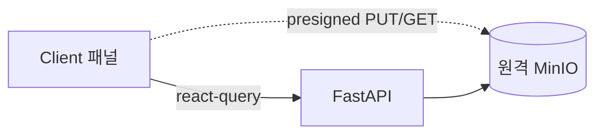

# 10. 프론트엔드 (3-Panel Drive UI)

## 1. 개요 / 범위
Next.js 16/React 19 기반 3패널 Drive UI. 서버/클라이언트 분리, 데이터·상태 관리, 컴포넌트, 반응형.
- **제품(앱) 표기명: `Mechive`** — 브라우저 타이틀(`<title>`/메타데이터)·헤더 브랜드에 사용. (저장소/서비스 식별자 `document-archive-refine`·MinIO 버킷명은 변경하지 않음 — 표시명만.)

## 2. 요구사항 매핑
3-Panel 레이아웃, 폴더/문서 CRUD, 업/다운로드, 검색·AI 산출물 UI. **라이트/다크 테마, PC/태블릿/모바일 3단 반응형.**

## 3. 설계 결정
- react-query 1차 데이터 레이어 + Zustand UI 상태, RSC 셸 + Client 패널.
- 파일 업/다운로드는 원격 MinIO presigned 직접 호출(06). API는 `NEXT_PUBLIC_API_URL` 주입.
- **테마: `next-themes` + Tailwind `dark:` / shadcn CSS 변수 토큰.** 시스템 설정 추종 + 수동 토글, 토큰은 라이트/다크 듀얼 정의. RSC FOUC 방지(`suppressHydrationWarning`).
- **반응형: PC/태블릿/모바일 3단**(Tailwind `lg`/`md` 기준). 상세는 §12.

## 4. 전체 레이아웃 컴포넌트 맵 (우선 구상)
세부 설계 전에 컴포넌트 트리·책임·상태 소유를 먼저 확정.
```
ThemeProvider (next-themes, attribute="class" defaultTheme="system" enableSystem)   # §3
└─ AppShell (RSC)                                 # 브랜드명 "Mechive"(§1)
   ├─ AppHeader (client)                          # SearchBar + ThemeToggle(light/dark/system)
   │  ├─ SearchBar → SearchResults (client)       # 검색·결과, 인용 클릭 딥링크(§11)
   │  └─ AskDialog (client)                       # RAG 질의(Dialog)
   ├─ ResizablePanels (client, ≥md)               # 모바일(<md)은 단일 패널로 대체(§12)
   │  ├─ LeftPanel: FolderTree (client)           # 상태: 선택/확장(Zustand). AppHeader 토글(§8b). 모바일=Sheet
   │  │  └─ FolderActions (per-folder "⋯" DropdownMenu): 이동/이름변경/삭제  # §8a (Left 트리·Center 목록 공용)
   │  ├─ CenterPanel                              # 문서 "목록" 전용(하단 상세 패널 제거)
   │  │  ├─ (UploadDropzone (client))             # presigned PUT — 컴포넌트 보존, MVP UI 미노출(§10)
   │  │  └─ DocumentList (client)                 # 하위 폴더 row + 문서 row(Google Drive식 §10). 폴더 row: "⋯" FolderActions + 단일클릭=인스펙터/더블클릭=진입(§8)
   │  └─ RightPanel = DetailInspector             # 토글형(§8b), 문서/폴더 양쪽. 모바일=전체화면 Sheet(side=right)
   │     ├─ DocumentDetail (client)               # 문서: status/stage 폴링 + "원본 보기" 버튼(§10)
   │     ├─ MetadataView (client)                 # 문서: AI 메타 읽기 전용(§7a) + 업로드·인제스트 소요 시간(§11)
   │     ├─ GenerationTrigger (client)            # 요약/초안/보고서 생성 시작(Dialog)
   │     ├─ ArtifactList "산출물 내역" (client)    # 생성 이력 개명 — row 클릭=산출물 문서 폴더로 이동(§11), 생성 소요 시간
   │     └─ FolderDetail (client)                 # 폴더 선택 시: 이름/등록일/하위 항목 수(§7a)
   ├─ Dialogs (client, 모바일 풀스크린 §12)
   │  ├─ NewFolderDialog       (이름 입력)                 # §8a
   │  ├─ RenameFolderDialog    (이름 입력)                 # §8a
   │  ├─ MoveFolderDialog      (트리 표현 + 대상 상위 폴더 선택)  # §8a, MOVE=05 §6
   │  ├─ DeleteConfirm         (alert-dialog, 재귀 삭제 경고)
   │  └─ OriginalViewerDialog  (텍스트류=마크다운 뷰어; 그 외=다운로드, 다이얼로그 없음) # §10
   └─ Toaster (sonner, client)                    # 업로드/인제스트/생성 완료·실패 알림
```
| 컴포넌트 | 종류 | 데이터/상태 |
|---|---|---|
| ThemeProvider | client | next-themes(라이트/다크/시스템), FOUC 방지(§3) |
| AppShell | RSC | 초기 트리·목록 패치(Suspense), 브랜드 "Mechive" |
| AppHeader/ThemeToggle | client | 테마 토글(로컬), 검색 입력 |
| FolderTree + FolderActions | client | react-query(트리) + Zustand(선택/확장), "⋯" 드롭다운(이동/이름변경/삭제) |
| DocumentList | client | shadcn `Table` + **TanStack Table 헤드리스(`manualPagination`)** + react-query(목록 + status/stage 폴링), **하위 폴더 row + 문서 row**. 폴더 row: **단일클릭=인스펙터 토글/더블클릭=진입** + "⋯" FolderActions. 문서 row: 클릭 토글·"⋯" |
| UploadDropzone | client | presigned 3단계 — **컴포넌트 보존, MVP UI에서는 미노출**(추후 업로드 진입점 재배치, §10) |
| DetailInspector(RightPanel) | client | **토글형** — 문서/폴더 row 클릭으로 열림/닫힘 토글(§8b). **문서=DocumentDetail+MetadataView+생성, 폴더=FolderDetail**. 닫기 버튼 없음 |
| DocumentDetail | client | status/stage + 원본 보기(§10). 미리보기 영역 없음 |
| MetadataView | client | react-query(읽기 전용), AI 메타 표시(§7a) + **업로드·인제스트 소요(`ingest_ms`)** |
| FolderDetail | client | 폴더 이름·등록일·하위 항목 수(읽기 전용). AI 메타·생성 없음 |
| GenerationTrigger | client | react-query mutation(POST /generations, 202) |
| ArtifactList(산출물 내역) | client | react-query 폴링. 출력 문서 존재 건만(09 §9a), row 클릭=Center가 산출물 문서 폴더로 이동, 생성 소요(`latency_ms`) |
| NewFolder/Rename/MoveFolderDialog | client | 05 §8(POST/PATCH), Move=트리 선택 UI |
| SearchBar/SearchResults/AskDialog | client | react-query(POST /search·/search/ask) |
| Toaster | client | sonner(전역 알림) |

> **반응형 합성(§12):** `≥md`는 `ResizablePanels` 2패널(Left 트리 / Center 목록) + 토글형 Right 인스펙터, `<md`는 CenterPanel 단일 + Left=`Sheet`·Right=**전체 화면 `Sheet`(side=right)**(바텀 시트 아님). **모든 다이얼로그는 모바일에서 전체 화면**. 동일 컴포넌트를 컨테이너만 바꿔 재사용.

## 5. 서버/클라이언트 분리
RSC: 페이지 셸·초기 패치(패널별 Suspense 스트리밍). Client(`"use client"`): 트리/드롭존/다이얼로그/인스펙터 토글 등 고상호작용.

## 6. 데이터 레이어
react-query(목록/상세/트리 + 파이프라인·생성 폴링 + 캐시·낙관 업데이트). RSC 초기 렌더는 `HydrationBoundary`로 시드. Server Actions는 선택(FastAPI와 로직 중복 금지).

## 7. UI 상태
선택/확장은 Zustand(또는 context). 트리는 평면 리스트(05)에서 `useMemo` 구성. 낙관 업데이트 후 실패 시 롤백.

**소유 경계 확정(1.3 검증):**
- **Zustand(클라이언트 UI 상태):** `selectedFolderId`, `selectedDocumentId`, 폴더 확장 집합(`expandedFolderIds`), 모바일 Sheet/Drawer 개폐, 검색 입력값/모드(`q`,`mode`). 이 선택 상태가 **react-query 쿼리 키를 구동**(예: `["documents", selectedFolderId]`).
- **react-query(서버 데이터):** 트리·목록·상세·검색 결과·생성 이력 + 파이프라인/생성 폴링. 캐시·낙관 업데이트·무효화 담당.
- **next-themes:** 라이트/다크/시스템 테마 — Zustand에 두지 않음(§3, 자체 persistence·SSR 처리).
- 경계 원칙: **서버가 출처면 react-query, 클라이언트 전용(선택/토글/입력)이면 Zustand.** 서버 데이터를 Zustand로 복제 금지.

### 7a. 인스펙터 표시(읽기 전용 — MVP): 문서 메타 / 폴더 / 소요 시간
문서 본문은 본 웹앱에서 편집하지 않는다(읽기 전용 보관함). **AI가 추출한 메타데이터(제목/요약/토픽/키워드)도 MVP에서는 보정 기능 없이 그대로(읽기 전용) 표시**한다 — input/저장 없음. (보정 방식 추후 결정; 사례는 `research/01 §8`.)
- **폴더 인스펙터(FolderDetail):** Center 폴더 row **단일 클릭** 시 우측 인스펙터에 폴더 정보(이름·등록일·하위 항목 수)를 읽기 전용 표시. AI 메타·생성 트리거 없음. (**더블 클릭**은 폴더 진입, §8.)
- **소요 시간 표시(성능 측정용, 1.13.4):** 문서 인스펙터의 MetadataView에 **업로드·인제스트 소요**(`documents.ingest_ms`, 03 §5), AI 산출물 문서는 **생성 소요**(`generations.latency_ms`)를 초 단위로 표기. 검색·RAG 소요는 각 다이얼로그에 `elapsed_ms`(§11, 08 §12).
- **AI 산출물 계보(Lineage) 섹션(읽기 전용, 1.13.7):** 산출물 문서(= 어떤 생성의 `output_document_id`)면 메타 패널에 계보를 표시 — **부모(원본) 문서 링크(클릭=Center 이동)·종류·생성 모델/provider/seed·생성 소요·프롬프트(렌더된 system/user, 접기/다이얼로그)·인용 출처**. 데이터 = `GET /generations/{id}/lineage`(09 §10). 일반 업로드 문서엔 미표시. 계보 헤드는 산출물 삭제 후에도 보존(09 §9a).

## 8. 패널 구성 (Left 트리 / Center 목록 / Right 토글 인스펙터)
- **Left:** 폴더 트리 + CRUD/MOVE. 각 폴더 행에 **"⋯" 드롭다운**(§8a). 접기/펼치기는 **AppHeader의 토글 버튼**으로(§8b·sidebar-demo 참고; 패널 자체 헤더엔 닫기 버튼 없음).
- **Center:** 문서 **목록 전용**(Google Drive식 — 현재 폴더의 **하위 폴더 row + 문서 row**를 한 목록에 표기, 폴더 먼저). **폴더 row: 단일 클릭=우측 인스펙터에 폴더 정보 토글(§7a)·더블 클릭=진입, "⋯" FolderActions(이동/이름변경/삭제, §8a).** 문서 row: 클릭=인스펙터 토글(§8b). 업로드 영역은 **MVP UI에서 미노출**(컴포넌트는 보존). 하단 DocumentDetail 패널 제거 — 상세는 Right로 통합.
- **Right = DetailInspector(토글형 §8b, 문서/폴더 양쪽):** 문서=상세(status/stage·원본 보기 §10) + 메타(읽기 전용 §7a) + AI 생성 트리거·**"산출물 내역"**(09); 폴더=FolderDetail(§7a). Center·Right 간 기능 중복 없음. **개폐는 row 클릭 토글로**(패널 헤더에 별도 닫기 버튼 없음, §8b).

### 8a. 폴더 액션 & 폴더 다이얼로그
- **폴더 "⋯" DropdownMenu**(공용 `FolderActions` — **Left 트리 행·Center 목록 폴더 행 양쪽**): **이동 / 이름 변경 / 삭제**. (참고 UX: shadcn sidebar-demo의 행별 액션 메뉴.) 트리 상단/루트엔 **"새 폴더"** 진입점.
- **우클릭 컨텍스트 메뉴(shadcn `context-menu`):** Left 트리 폴더·Center 폴더/파일 row에서 **마우스 우클릭** 시 동일 액션 메뉴 표시(폴더=이동/이름변경/삭제, 파일=상세 보기/다운로드/삭제). "⋯" 버튼과 **핸들러 공유**(동작 일원화).
- **NewFolderDialog:** 이름 입력 → `POST /folders {parent_id?, name}`(05 §8). 형제 중복명 409 인라인 표기.
- **RenameFolderDialog:** 이름 입력(현재명 pre-fill) → `PATCH /folders/{id} {name}`(05 §8).
- **MoveFolderDialog:** **폴더 트리 구조를 표현**하고 **옮길 대상 상위 폴더를 선택** → `PATCH /folders/{id} {parent_id}`(05 §6 MOVE). 자기 자신·후손은 선택 비활성(사이클 방지 422 사전 차단).

### 8b. 패널 토글 규칙 (Left / Right)
- **Right 인스펙터(문서/폴더 양쪽):** **항상 노출이 아니라 토글**한다 — **문서 row 클릭** 또는 **폴더 row 단일 클릭**으로 해당 항목 인스펙터를 열고, **같은 row 재클릭 시 닫힘**(또는 row "⋯"로 열림). 상태는 Zustand의 **선택 항목**(`selected: {kind:'doc'|'folder', id} | null`): 같은 항목 재선택이면 `null`(닫힘). **폴더는 더블 클릭 시 진입(§8)** — 단일=인스펙터, 더블=네비게이션. **패널 자체에는 닫기 버튼을 두지 않는다.**
- **Left 트리:** **AppHeader의 토글 버튼**으로 접고/펼침(패널 자체 헤더엔 닫기 버튼 없음). 접힘 상태는 Zustand UI 상태(`leftCollapsed`)로 보유.
- **브레이크포인트별:** `≥md`는 패널 펼침/접힘(Left는 AppHeader 트리거로 재오픈), `<md`는 Left=`Sheet`(side=left)·Right=**전체 화면 `Sheet`(side=right)**(바텀 시트 아님) 개폐(§12). 참고 UX: shadcn `sidebar-demo`(base-nova).

## 9. 컴포넌트 선정·커스터마이징 전략
컴포넌트 구현 시 **shadcn/ui MCP로 적합한 컴포넌트를 탐색·선정**하고, 자세한 커스터마이징은 **Tailwind CSS**로 진행. 기본 빌딩블록: Resizable(react-resizable-panels), tree-view(shadcn-tree-view), dropzone(shadcn-dropzone)→presigned PUT, Lucide 아이콘.
- **데이터 테이블(DocumentList):** shadcn `Table`(프레젠테이션) + **TanStack Table `@tanstack/react-table` 헤드리스 코어**(`useReactTable`/`getCoreRowModel`). **서버사이드 페이지네이션 기준**(`manualPagination: true`, 정렬/필터도 서버 위임 가능) — 목록 계약 `GET /documents?folder_id=&limit=&cursor=`(06 §5, cursor/keyset) + react-query 바인딩. 하위 폴더 row는 동일 테이블의 행 종류(§10). API·옵션은 **context7 MCP로 TanStack Table v8 최신 문서 확인 후** 작성.

## 10. 목록(Google Drive식) + 업로드/다운로드 UX + 원본 보기
- **목록 구성(Google Drive식):** Center 목록은 현재 폴더의 **하위 폴더 행 + 문서 행**을 한 목록에 표기한다(폴더 먼저, 문서 다음). **폴더 행: 단일 클릭=우측 인스펙터 토글(FolderDetail §7a)·더블 클릭=진입(`selectFolder`)**, 문서 행 클릭=Right 인스펙터 토글(§8b). **AI 산출물도 일반 문서 행으로 함께 표기**(09 §9a). 목록은 패널 가장자리와 떨어지도록 좌우 패딩을 두고, 목록 헤더 상단 border는 두지 않는다.
- **업로드 진입:** presigned 3단계(06) UX 자체는 유지하되 **MVP UI에서는 업로드 영역(드롭존)을 노출하지 않는다**(`UploadDropzone` 컴포넌트는 보존, 추후 진입점 재배치).
- presigned 3단계(06) 연동, 진행률 표시, 인제스트 `status/stage` 폴링(ready/failed 정지).
- **원본 미리보기 영역 없음.** DocumentDetail에는 **"원본 보기" 버튼**만 둔다:
  - **텍스트류(`text/markdown`·`text/plain` 등 → mime_type 기준):** `OriginalViewerDialog`로 **마크다운 뷰어** 렌더(다운로드 없이 인앱 열람).
  - **그 외(PDF·이미지·바이너리):** presigned GET **다운로드**로 처리(06 §5, 인앱 렌더 안 함).
- **표시 날짜는 등록일(`created_at`)만 노출** — 문서는 인앱 편집이 없으므로 "수정일"은 의미가 없어 화면에서 제외(`updated_at`·`doc_modified_at`은 내부 보존하되 미노출).

## 11. 검색·AI 산출물 UI
두 동선은 **출력물이 다르므로 분리**한다(역할 혼선 방지):
- **검색 다이얼로그 = retrieval:** `POST /search`(08 §12) → **문서/청크 결과 "리스트"**. **모드 선택 UI 없이 항상 하이브리드(§6 RRF) 고정** — 키워드(PGroonga 정확 매칭) + 벡터(의미)를 이미 융합하므로 단일 용어든 자연어든 결정적·견고. 모드 뱃지는 두지 않는다(§8 GBNF 라우터는 LLM 분류라 단순 검색엔 과함·비결정적). **"RAG" 모드도 없음**(생성 답변은 RAG 질문). 결과·인용 클릭 → 원문 딥링크. **검색 소요 시간(`elapsed_ms`) 표시**(성능 측정용).
- **"RAG 질문" = RAG QA:** `POST /search/ask`(08 §12) → **합성 답변 1개 + 인용 `[n]`**(08 §9·§10). 버튼/다이얼로그 라벨은 **"RAG 질문"**(검증: `/search/ask`는 컨텍스트 조립 + 인용 강제 생성 = RAG, 08 §9·§10). 생성형 답변은 이 동선에만. 프롬프트 입력은 **자동 개행 textarea**(초기 1줄→최대 n줄 auto-grow 후 스크롤, Enter=전송/Shift+Enter=줄바꿈). **RAG 전체 소요 시간(`elapsed_ms`) 표시**.
- (`rag`는 08 §8 GBNF 라우터의 **intent 분류값**일 뿐, 검색 결과 리스트의 한 모드가 아니다.)
- **AI 산출물 = 1급 문서(09 §9a):** 요약/초안/보고서는 **문서로 저장**되어 Center 목록·검색·RAG에 일반 문서처럼 포함된다. 생성 트리거 + **"산출물 내역"**(생성 이력 개명)은 Right 인스펙터(09 연동, §8): **내역 row 클릭 → Center가 해당 산출물 문서의 폴더로 이동·선택**, 출력 문서를 Center에서 삭제하면 내역에서 사라진다(`output_document_id` SET NULL).

## 12. 반응형 (PC/태블릿/모바일)
- **PC·태블릿(`≥md` 768+):** Left 트리 + Center 목록 + ResizablePanels. **Left는 AppHeader 토글로 접고/펼침**, **Right는 문서 row 클릭 토글**로 펼침/접힘(§8b). 태블릿은 동일 구성(패널 폭만 축소).
- **모바일(`<md` <768):** 단일 패널(Center 목록) + Left=`Sheet`(side=left, 트리)·Right=**전체 화면 `Sheet`(side=right, 상세 인스펙터)**(바텀 시트 아님). 개폐는 Left=AppHeader 토글, Right=row 클릭 토글(§8b).
- **다이얼로그 풀스크린:** 모든 Dialog(New/Rename/MoveFolder, Ask, GenerationTrigger, OriginalViewer 등)는 **모바일 해상도에서 전체 화면**으로 표시(데스크톱은 중앙 모달). 반응형 클래스로 `<md` 시 `w-screen h-dvh`·라운드/마진 제거. **콘텐츠는 상단 정렬 flex column으로 화면을 채워** 수직 중앙으로 "붕 뜨는" 현상을 방지한다(shadcn DialogContent 기본 중앙 정렬 오버라이드).

패널별 독립 스트리밍. 테마(라이트/다크)는 모든 브레이크포인트 공통(§3).

## 13. 다이어그램


## 14. 제약·리스크
브라우저→원격 MinIO presigned 호출 시 **버킷 CORS 설정** 필요. API 계약(05~09) 확정 후 작성. 폴링 주기 조정.

## 참고
`research/04 §5`.
